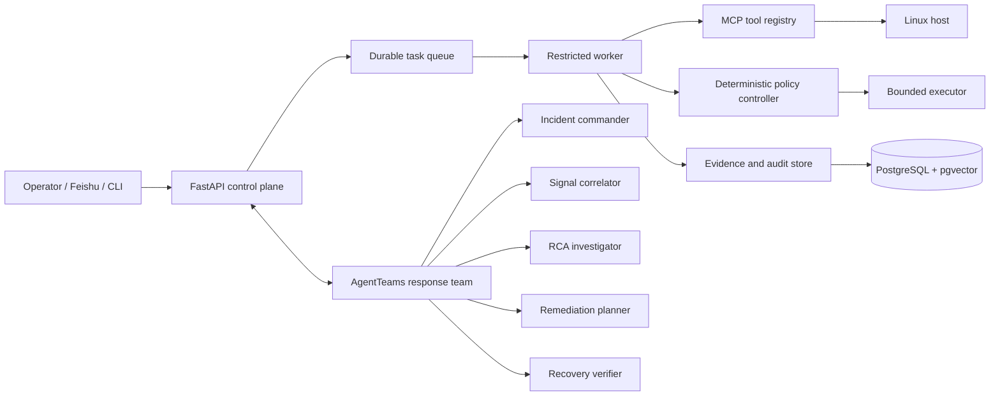

# OpsCouncil

OpsCouncil is an evidence-constrained autonomous operations control plane for Linux. It turns an operator request or a live incident into a traceable workflow that collects host evidence, builds competing root-cause hypotheses, proposes bounded actions, enforces policy, verifies recovery independently, and records the complete decision chain.

The language model proposes and explains. Deterministic policy code owns authorization and execution.

## Why OpsCouncil

- **Evidence before action**: every diagnosis and action contract names the observations that support it and the evidence still missing.
- **Bounded autonomy**: reversible actions may run only inside an explicit policy envelope; irreversible or high-impact work requires an operator decision.
- **Independent recovery verification**: recovery is evaluated against pre-action state and service expectations, not against the planner's own narrative.
- **Role-scoped multi-agent collaboration**: AgentTeams workers receive separate identities, skills, MCP surfaces, and callback tokens.
- **Tamper-evident operations memory**: audit and collaboration events form hash-linked chains; only qualified outcomes enter reusable memory.
- **Real Linux telemetry**: tools read processes, listeners, journals, file integrity, disk pressure, service state, and open-deleted files from the host where OpsCouncil runs.

## Architecture



The response team uses five explicit roles. The policy controller is deliberately outside the model team: an agent cannot grant itself permission, widen an action contract, or declare its own recovery proof sufficient.

## Core Workflow

1. Normalize the request and reject prompt injection or prohibited intent.
2. Capture a task-bound platform capability snapshot.
3. Collect observations through read-only, semantically typed MCP tools.
4. Build hypotheses and evidence obligations under fixed iteration, tool-call, and time budgets.
5. Compile a canonical action contract with target, preconditions, blast radius, rollback, and verification checks.
6. Re-evaluate the exact bound action through deterministic policy.
7. Execute with a restricted account or wait for operator approval.
8. Verify recovery independently and append the outcome to the hash-linked audit trail.
9. Qualify successful, evidence-backed outcomes before admitting them to operational memory.

## Requirements

- Linux on `x86_64`, `aarch64`/`arm64`, `loongarch64`, or `riscv64`
- Python 3.10-3.13
- PostgreSQL with the `vector` extension
- Node.js 20+ to rebuild the Vue frontend
- `systemd`, `journalctl`, `ss`, `ps`, and `curl` for the full host integration
- Docker or Podman only when AgentTeams is enabled

## Quick Start

```bash
git clone https://github.com/Jpl-hub/opscouncil.git
cd opscouncil

cp .env.example .env
chmod 0600 .env
# Set DATABASE_URL and BAILIAN_API_KEY in .env.

export OPSCOUNCIL_DB_PASSWORD='use-a-strong-deployment-password'
./scripts/prepare.sh
./scripts/preflight.sh
./scripts/migrate.sh
./scripts/run.sh
```

Start the durable task worker in another shell:

```bash
.venv/bin/python scripts/worker.py
```

Then open `http://127.0.0.1:8000`. Production installation and systemd hardening are covered in [the Linux deployment guide](docs/deployment/linux.md).

## CLI

`opscouncilctl` exposes the same governed task path as the web interface:

```bash
python scripts/opscouncilctl.py doctor --strict
python scripts/opscouncilctl.py ask 检查当前主机的监听端口和暴露风险
python scripts/opscouncilctl.py approvals --status PENDING_APPROVAL
python scripts/opscouncilctl.py audit TRACE_ID
```

## AgentTeams

OpsCouncil targets AgentTeams v1.2 or newer. Install AgentTeams using its official distribution, ensure `agentteams-manager` is running, and expose the OpsCouncil API at an address reachable by Worker containers.

```bash
export OPSCOUNCIL_API_URL=http://host.containers.internal:8000
export AGENTTEAMS_CALLBACK_SECRET='generate-a-random-deployment-secret'
python -m agentteams.scripts.deploy_team
```

The deployment command refuses to overwrite an existing OpsCouncil team. Use `--replace` only when intentionally recreating all five Workers so package instructions and role-scoped MCP credentials are updated atomically.

## Verification

```bash
python -m pytest -q
npm --prefix frontend ci
npm --prefix frontend run build
OPSCOUNCIL_REQUIRE_MODEL=true \
OPSCOUNCIL_REQUIRE_WORKER=true \
./scripts/smoke_check.sh
```

## Security

Do not commit `.env`, Feishu credentials, model API keys, generated AgentTeams packages, or runtime databases. Report security issues through the private process described in [SECURITY.md](SECURITY.md).

## License

Apache License 2.0. See [LICENSE](LICENSE).
