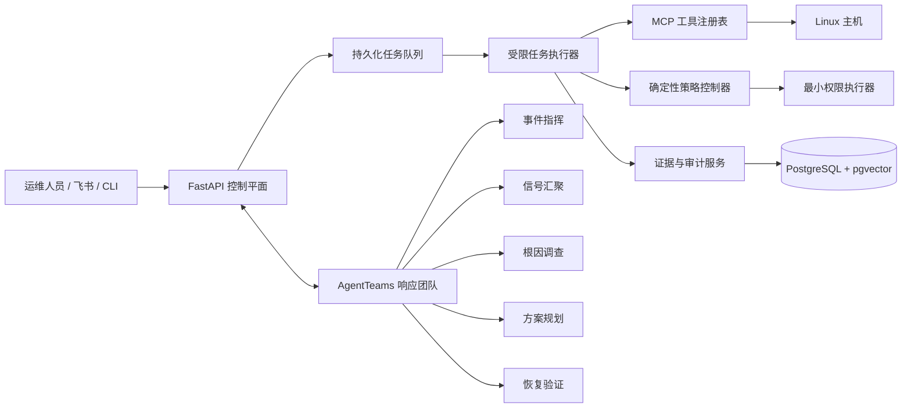

# OpsCouncil

OpsCouncil 是面向 Linux 的证据约束型自主运维控制平面。它将运维请求或实时事件转化为可追踪的处置流程：采集主机证据、构建根因假设、生成有边界的操作方案、执行确定性策略校验、独立验证恢复结果，并记录完整决策链。

大模型负责理解、规划与解释；确定性策略代码负责授权与执行。Agent 不能自行授予权限、扩大操作范围，也不能用自己的结论代替恢复验证。

## 核心能力

- **先取证，后处置**：诊断结论必须引用观测证据，并明确尚未满足的证据条件。
- **有界自治**：只有命中明确策略、参数完全绑定且可回滚的动作，才允许自动执行；其余动作进入人工审批。
- **独立验证**：恢复验证依据执行前基线、服务目标和真实回读结果完成，不采信规划 Agent 的自证。
- **职责隔离**：AgentTeams 中的信号汇聚、根因调查、方案规划、恢复验证和事件指挥分别使用独立身份、Skill、MCP 工具面与回调凭证。
- **防篡改审计**：任务、工具调用和协作事件形成哈希链；只有经过验证的处置结果才能进入长期运维记忆。
- **真实主机感知**：从部署主机读取进程、端口、日志、磁盘、服务、配置完整性及已删除未释放文件等状态。
- **多入口协同**：Web、命令行和飞书入口共用同一任务队列、安全策略和审计链。

## 系统架构



策略控制器独立于模型团队运行。每一项可执行方案都绑定提案编号、工具、参数、风险等级、策略版本与内容哈希，执行后由不同角色回读验证。

## 处置流程

1. 规范化请求，识别提示词注入和禁止意图。
2. 保存与任务绑定的平台能力快照。
3. 通过只读、语义化 MCP 工具采集现场证据。
4. 在固定迭代次数、工具调用次数和时间预算内构建根因假设。
5. 编译包含目标、前置条件、影响范围、回滚与验证项的动作契约。
6. 确定性策略引擎重新校验已绑定的完整动作。
7. 命中自治策略的动作由受限账户执行，其他动作等待运维人员审批。
8. 独立验证恢复状态，并将结果追加到哈希审计链。
9. 仅将证据充分、结果已验证的经验写入长期运维记忆。

## 环境要求

- Linux：`x86_64`、`aarch64` / `arm64`、`loongarch64` 或 `riscv64`
- Python 3.10-3.13
- PostgreSQL 及 `vector` 扩展
- Node.js 20 及以上版本（仅用于重新构建 Vue 前端）
- 完整主机集成需要 `systemd`、`journalctl`、`ss`、`ps` 和 `curl`
- 启用 AgentTeams 时需要 Docker 或 Podman

## 快速开始

```bash
git clone https://github.com/Jpl-hub/opscouncil.git
cd opscouncil

cp .env.example .env
chmod 0600 .env
# 在 .env 中配置 DATABASE_URL 和 BAILIAN_API_KEY。

export OPSCOUNCIL_DB_PASSWORD='请替换为高强度部署密码'
./scripts/prepare.sh
./scripts/preflight.sh
./scripts/migrate.sh
./scripts/run.sh
```

另开终端启动持久化任务执行器：

```bash
.venv/bin/python scripts/worker.py
```

随后访问 `http://127.0.0.1:8000`。生产环境安装、systemd 服务与权限加固见[Linux 部署文档](docs/deployment/linux.md)。

## 命令行

`opscouncilctl` 与 Web 界面使用同一条受控任务链：

```bash
python scripts/opscouncilctl.py doctor --strict
python scripts/opscouncilctl.py ask 检查当前主机的监听端口和暴露风险
python scripts/opscouncilctl.py approvals --status PENDING_APPROVAL
python scripts/opscouncilctl.py audit TRACE_ID
```

## AgentTeams

OpsCouncil 适配 AgentTeams 1.2 及以上版本。按照 AgentTeams 官方方式完成安装，确认 `agentteams-manager` 正常运行，并确保 Worker 容器可访问 OpsCouncil API。

```bash
export OPSCOUNCIL_API_URL=http://host.containers.internal:8000
export AGENTTEAMS_CALLBACK_SECRET='请生成独立的高强度随机值'
python -m agentteams.scripts.deploy_team
```

部署命令默认拒绝覆盖已有团队。只有在需要原子更新五个 Worker 的身份、Skill 与 MCP 凭证时，才显式使用 `--replace`。

## 验证

```bash
python -m pytest -q
npm --prefix frontend ci
npm --prefix frontend run build
OPSCOUNCIL_REQUIRE_MODEL=true \
OPSCOUNCIL_REQUIRE_WORKER=true \
./scripts/smoke_check.sh
```

## 安全说明

不要提交 `.env`、飞书凭证、模型 API Key、生成后的 AgentTeams 包或运行时数据库。安全问题请通过 [SECURITY.md](SECURITY.md) 中的非公开渠道反馈。

## 开源许可

本项目采用 Apache License 2.0，详见 [LICENSE](LICENSE)。
