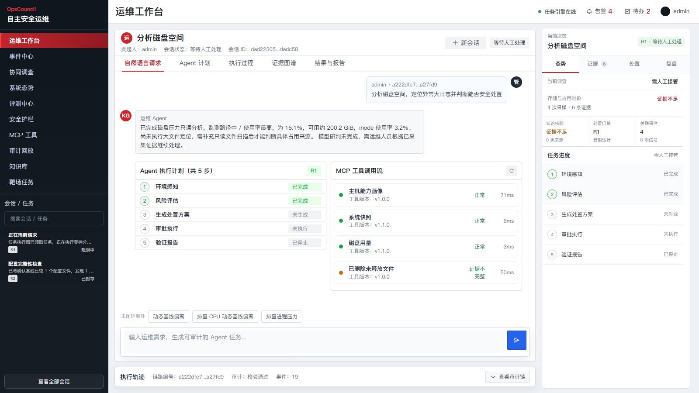
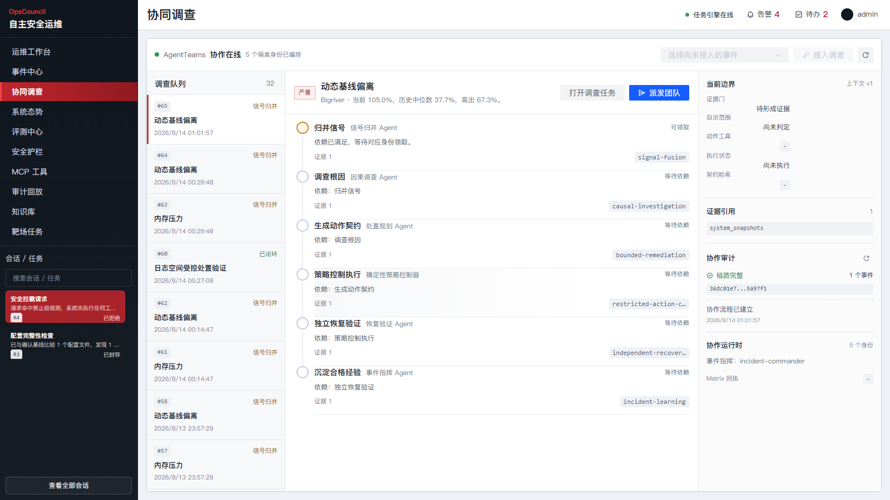
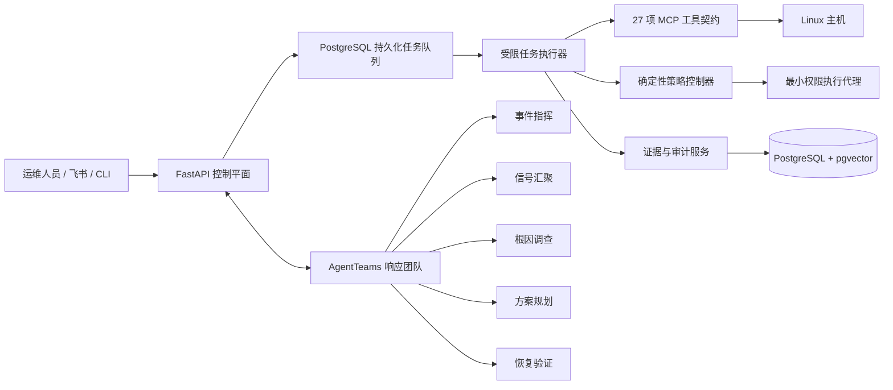

# OpsCouncil

**让运维 Agent 的每个结论有证据、每个动作有边界、每次恢复可验证。**

[](LICENSE)
[](requirements/base.txt)
[](backend/app/main.py)
[](frontend/package.json)

OpsCouncil 是面向 Linux 生产节点的证据约束型自主运维控制平面。它把自然语言请求和实时事件转化为一条可追踪的处置链：现场感知、根因调查、动作规划、策略授权、受限执行、独立验证和经验沉淀。

大模型负责理解、归纳和提出方案；独立的确定性策略控制器决定动作能否执行。Agent 不能自行授予权限、扩大操作范围，也不能用自己的结论代替恢复验证。



## 关键差异

| 能力 | OpsCouncil 的实现 |
| --- | --- |
| 证据约束调查 | 结论引用实际 MCP 观测，缺失证据会被明确标记，不用推测补齐事实 |
| 有界自治 | 动作契约绑定工具、参数、风险、前置条件、回滚和验证项，策略控制器二次校验 |
| 职责隔离 | 事件指挥、信号汇聚、根因调查、方案规划和恢复验证使用独立身份与工具权限 |
| 最小权限执行 | 只读调查默认运行；有副作用动作进入隔离执行与审批，R4 请求直接拒绝 |
| 可验证恢复 | 执行后由独立角色回读系统状态，只有验证通过的结果才能进入长期记忆 |
| 可复盘审计 | 任务、工具调用、审批、协作和验证事件形成哈希链，可按阶段重放 |

## 一条真实闭环

```text
自然语言 / 告警
    -> 持久化任务队列
    -> 只读 MCP 取证
    -> 多角色根因调查
    -> 精确动作契约
    -> 确定性策略校验
    -> 人工审批或受限执行
    -> 独立恢复验证
    -> 哈希审计与运维记忆
```

本地验收记录覆盖三类代表性路径：

- **只读调查**：网络暴露面任务调用 4 项真实主机工具，形成 18 个审计事件后封存。
- **受控处置**：12 MiB 日志经审批后由受限账户备份并轮转，独立验证回读成功，审计链包含 22 个事件。
- **恶意请求**：提示词注入与 `rm -rf /` 请求命中 3 条禁止规则，工具调用数为 0，系统未发生变更。



## 系统架构



五个角色通过版本化上下文、工作项租约和结构化交付物协作。策略控制器位于模型团队之外；每项可执行方案都绑定提案编号、工具、参数、风险等级、策略版本和内容哈希。

## 运维入口

- **Web 工作台**：任务会话、执行计划、MCP 调用、证据图谱、审批和恢复验证集中呈现。
- **飞书协同**：消息进入同一任务队列，审批、进度和结果回传使用同一安全边界。
- **CLI**：适合诊断、批量提交、审批队列查询和审计导出。
- **事件中心**：接收巡检发现和外部事件，关联同一主机上的证据与历史任务。
- **知识工作区**：导入运维规范和故障复盘，使用 PostgreSQL 全文检索与 pgvector 混合召回，回答保留来源引用。

## 工程组成

- FastAPI 控制平面与 Vue 3 前端
- PostgreSQL 持久化状态、任务租约、审计事件和运维记忆
- pgvector 语义索引与 PostgreSQL 全文检索
- 5 个 Agent Identity、6 类 Skill、27 项 MCP 工具契约
- systemd 服务、受限本地执行器、容器化 AgentTeams
- R0-R4 风险模型、审批令牌、回滚与独立验证
- 安全对抗、能力回归和靶场场景

## 环境要求

- Linux：`x86_64`、`aarch64` / `arm64`、`loongarch64` 或 `riscv64`
- Python 3.10-3.13
- PostgreSQL 及 `vector` 扩展
- Node.js 20 及以上版本（仅用于重新构建 Vue 前端）
- 完整主机感知需要 `systemd`、`journalctl`、`ss`、`ps` 和 `curl`
- 启用 AgentTeams 时需要 Docker 或 Podman

## 快速开始

```bash
git clone https://github.com/Jpl-hub/opscouncil.git
cd opscouncil

cp .env.example .env
chmod 0600 .env
# 在 .env 中配置 DATABASE_URL 和 BAILIAN_API_KEY。

export OPSCOUNCIL_DB_PASSWORD='请替换为高强度部署密码'
./scripts/prepare.sh
./scripts/preflight.sh
./scripts/migrate.sh
./scripts/run.sh
```

另开终端启动持久化任务执行器：

```bash
.venv/bin/python scripts/worker.py
```

访问 `http://127.0.0.1:8000`。生产安装、systemd 服务和权限加固见 [Linux 部署文档](docs/deployment/linux.md)。

## 命令行

```bash
python scripts/opscouncilctl.py doctor --strict
python scripts/opscouncilctl.py ask 检查当前主机的监听端口和暴露风险
python scripts/opscouncilctl.py approvals --status PENDING_APPROVAL
python scripts/opscouncilctl.py audit TRACE_ID
```

## 验证

```bash
python -m pytest -q
npm --prefix frontend ci
npm --prefix frontend run build
OPSCOUNCIL_REQUIRE_MODEL=true \
OPSCOUNCIL_REQUIRE_WORKER=true \
./scripts/smoke_check.sh
```

## 安全说明

不要提交 `.env`、飞书凭证、模型 API Key、生成后的 AgentTeams 包、运行数据库或证据产物。安全问题请通过 [SECURITY.md](SECURITY.md) 中的非公开渠道反馈。

## 开源许可

本项目采用 [Apache License 2.0](LICENSE)。欢迎通过 Issue 和 Pull Request 参与工具、Skill、部署适配与评测场景建设。
